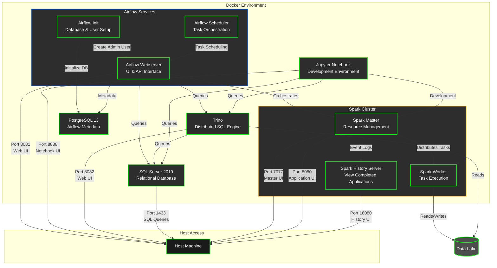

# Data Platform

A modern data platform built with Airflow, Spark, SQL Server, Trino, and Jupyter.

## Architecture



## Services

The platform consists of the following services:

- **Airflow**: Orchestrates ETL pipelines using LocalExecutor
  - **Airflow Init**: Initializes the database and creates admin user
  - **Airflow Webserver**: Provides the web interface and API
  - **Airflow Scheduler**: Manages task scheduling and execution
- **Spark**: Processes data using PySpark 3.3
  - **Spark Master**: Manages resources and coordinates tasks
  - **Spark Worker**: Executes tasks and processes data
- **SQL Server**: Provides relational database capabilities
- **Trino**: Distributed SQL query engine
- **Jupyter**: Interactive development environment
- **PostgreSQL**: Metadata database for Airflow

## Prerequisites

- Docker Desktop
- Git
- Conda (Miniconda or Anaconda)
- At least 8GB RAM
- 20GB free disk space

## Setup

### 1. Clone the Repository
```bash
git clone <repository-url>
cd data-platform
```

### 2. Set Up Development Environment
```bash
# Create and activate conda environment
./setup_env.sh
conda activate data-platform
```

### 3. Start the Services
```bash
docker compose up --build
```

## Accessing the Services

### Airflow UI
- URL: http://localhost:8081
- Credentials:
  - Username: airflow
  - Password: airflow

### Trino UI
- URL: http://localhost:8082
- No authentication required

### Jupyter Notebook
- URL: http://localhost:8888
- Password: jupyter
- The Jupyter service uses the official `jupyter/datascience-notebook` image without additional dependencies.

### SQL Server
- Host: localhost
- Port: 1433
- Credentials:
  - Username: sa
  - Password: YourStrong!Passw0rd

### Spark UI
- Master UI: http://localhost:7077
- Application UI: http://localhost:8080

### Spark History Server
- URL: http://localhost:18080
- Purpose: The Spark History Server provides a web UI to view completed Spark applications, their event logs, and job details. It is useful for debugging, performance analysis, and auditing past Spark jobs.
- Event Logs Directory: `/opt/bitnami/spark/event-logs` (inside the container)
- The event logs are shared between the Spark containers and the History Server via a Docker volume.
- If you do not see completed applications:
  - Ensure your Spark jobs are configured to enable event logging and write to the correct directory.
  - Check that the event log files exist in the shared directory.
  - Review the History Server container logs for errors.
  - Confirm the volume mount in `docker-compose.yml` is correct.

## Development Workflow

### Running Tests
```bash
# Make sure you're in the conda environment
conda activate data-platform

# Run tests
pytest tests/
```

### Adding New DAGs
1. Create a new Python file in the `dags/` directory
2. Define your DAG using the Airflow Python API
3. The DAG will be automatically picked up by Airflow

### Working with Jupyter
1. Access Jupyter at http://localhost:8888
2. Use the token specified in docker-compose.yml
3. Create new notebooks in the `notebooks/` directory

### Adding Dependencies
1. Add new Python packages to `environment.yml`
2. Update the environment:
```bash
conda env update -f environment.yml
```

## Project Structure

```
data-platform/
├── dags/              # Airflow DAGs
├── jobs/              # Spark jobs
├── tests/             # Unit tests
├── data/              # Data files
├── notebooks/         # Jupyter notebooks
├── docker/            # Docker configurations
│   ├── airflow/      # Airflow Dockerfile
│   ├── spark/        # Spark Dockerfile
│   └── sqlserver/    # SQL Server Dockerfile
├── trino/            # Trino configuration
├── sqlserver/        # SQL Server data
├── environment.yml   # Conda environment
├── setup_env.sh      # Environment setup script
├── docker-compose.yml
└── README.md
```

## Contributing

1. Fork the repository
2. Create a feature branch
3. Commit your changes
4. Push to the branch
5. Create a Pull Request

## License

This project is licensed under the MIT License - see the LICENSE file for details. 